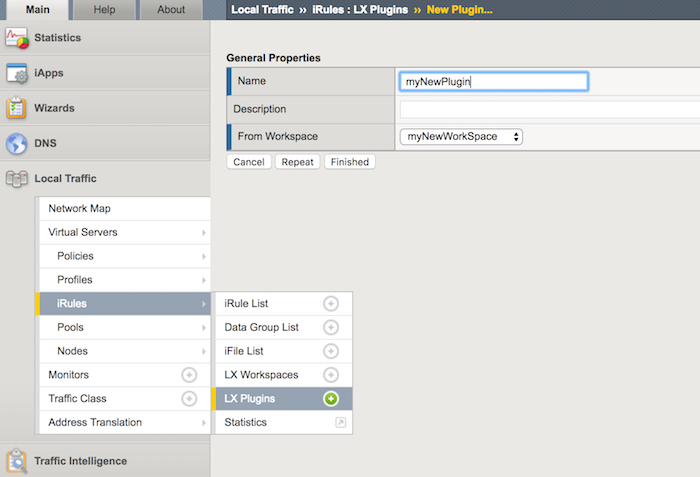

# My iRulesLX repo
Just a repo to store iRules LX solutions for others to use

# How to use
add a new iRules LX workspace


add an extension to the workspace


edit the extension's index and package.json


add an iRule to the workspace


edit the iRule


add a new iRules LX plugin


Add needed node modules via ssh, i.e.
```
config # cd /var/ilx/workspaces/Common/myNewWorkSpace/extensions/route53/
route53 # npm install validator --save
```